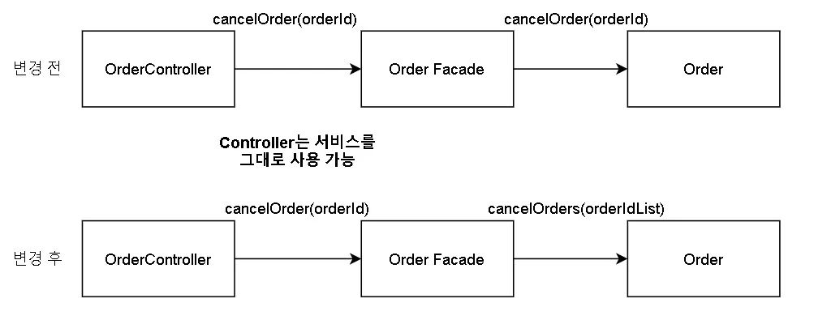

# 1. 개요

마틴 파울러의 'Pattern of Enterprise Application Architecture' 에서 언급하기를  
도메인 논리를 구성하는 방법에 대해 트랜잭션 스크립트, 도메인 모델, 테이블 모듈 세가지 주요 패턴으로 구분했습니다.  
이번 포스팅은 도메인 로직 패턴의 특징과 장단점 그리고 어떻게 사용하는가에 대해서 정리하고자 합니다.

```
이번 포스팅은 저명한 선배님들의아티클과 PoEAA, DDD, Clean Architecture 에서 인사이트를 얻었습니다.
참고한 내용을 정리한 것이나 보다 정확한 내용은 아래 '도움을 주신 분들'에 가서 원 글을 읽어보시기를 추천합니다.
```

1. [트랜잭션 스크립트 패턴](#2-트랜잭션-스크립트-패턴)
   1. [트랜잭션 스크립트 장점](#21-트랜잭션-스크립트-장점)
   2. [트랜잭션 스크립트 단점](#22-트랜잭션-스크립트-단점)
   3. [트랜잭션 스크립트 사용 시점](#23-트랜잭션-스크립트-사용-시점)
2. [도메인 모델 패턴](#3-도메인-모델-패턴)

   1. [도메인 모델 장점](#21-트랜잭션-스크립트-장점)
   2. [도메인 모델 단점](#22-트랜잭션-스크립트-단점)
   3. [도메인 모델 사용 시점](#23-트랜잭션-스크립트-사용-시점)
   4. [빈약한 도메인 모델과 풍부한 도메인 모델](24-트랜잭션-스크립트-사용-시점)
      1. [빈약한 도메인 모델 패턴](#31-빈약한-도메인-모델)
      2. [풍부한 도메인 모델 패턴](#32-풍부한-도메인-모델)

3. [테이블 모듈 패턴](#4-테이블-모듈-패턴)

   1. [테이블 모듈 장점](#41-테이블-모듈-장점)
   2. [테이블 모듈 단점](#42-테이블-모듈-단점)
   3. [테이블 모델 사용 시점](#43-테이블-모듈-사용-시점)

4. [서비스 계층 패턴](#5-서비스-계층-패턴)
   1. [서비스 계층 유형](#51-서비스-계층-유형)
      1. [Domain Facade](#511-domain-facade)
      2. [Operation Script](#512-operation-script)
   2. [서비스 계층에 대한 고찰](#52-서비스-계층에-대한-고찰)
5. [애그리게이트 패턴](#6-애그리게이트-패턴ddd)

---

# 2. 트랜잭션 스크립트 패턴


트랜잭션 스크립트(Transaction Script) 패턴은 도메인 논리를 저장하는 가장 간단한 방식입니다.  
클라이언트(웹/모바일/서버)의 요청이 들어오면 유효성 검사등을 진행한 뒤 데이터베이스에 데이터를 저장하고  
다른 시스템의 작업을 호출하는 프로시저를 호출하는게 일반적이며 필요에 따라 응답을 구성하고 반환합니다.

1. 잔고 확인
2. 받는 사람 확인
3. 이체 실행
4. 잔고 감소

계좌 이체를 진행하려면, 시스템에서는 위와 같은 절차들을 하나의 논리적인 로직으로서 처리해야만 합니다.
만약 한번이라도 오류가 발생하면 모든 처리가 취소되고, 모두 성공해야 작업이 수행 완료된 상태로 볼 수 있습니다.
이 같이 트랜잭션 스크립트는 `All-or-Nothing` 트랜잭션 개념을 기반으로 둡니다.

```java
public class TansferService {

        @Transactional
        public void transfer(final String toAccountNumber, final String fromAccountNumber, final BigDecimal amount) {
            checkAvailableAmount(fromAccountNumber, amount);
            checkAvailableAccount(toAccountNumber);
            increaseAccountAmount(toAccountNumber, amount);
            decreaseAccountAmount(fromAccountNumber, amount);
        }
}
```

트랜잭션 스크립트는 하나의 트랜잭션으로 구성된 로직을  
단일 함수 또는 단일 스크립트에서 처리하는 구조를 갖으며 이같은 이유로 이름이 '트랜잭션' 스크립트입니다.

## 2.1. 트랜잭션 스크립트 장점

트랜잭션 스크립트의 가장 큰 장점은 단순성입니다.  
작은 규모의 비즈니스 논리만을 포함한 애플리케이션에 매우 적합하며,  
코드를 실행할 때 발생하는 오버헤드가 적어 코드를 이해하기도 쉽습니다.

- 대부분의 개발자가 이해할 수 있는 간단한 절차적 모델입니다.
- 트랜잭션 경계 설정이 쉽습니다.

## 2.2. 트랜잭션 스크립트 단점

도메인 논리, 비즈니스 논리가 복잡해지면 설계 상태를 유지하기 어려워지며 복잡도가 상승합니다.
특히 문제가 되는 것이 **트랜잭션 간의 코드 중복입니다.**
트랜잭션 스크립트의 주 목적이 트랜잭션 하나를 처리하는 것이므로 공통적인 코드 중복이 발생합니다.

- 도메인 논리가 늘어나면 복잡도가 상승합니다.
- 공통 서브 루틴을 뽑아내는데 한계가 있습니다.

## 2.3. 트랜잭션 스크립트 사용 시점

시스템의 규모가 있으며 복잡한 도메인, 비즈니스 로직에는 적합하지 않습니다.  
사실 이 같은 시점이 오게 된다면 다른 패턴으로의 전환을 고려하는 것이 좋을 수도 있습니다.  
하지만, 트랜잭션 스크립트 패턴 사용을 무조건 지양하라는 이야기는 아닙니다.  
우리가 마주하는 문제들 중에 간단하게 해결할 수 있는 경우 사용하는 것을 권장합니다.

'트랜잭션' 이라는 것을 DB에 한정하지 않고 특정 목적을 위한 논리적인 단위라고 이해하고 있습니다.
필자는 Validation 을 담당하는 Validator 클래스가 존재할 때 이 패턴을 종종 사용합니다.
Validation 은 모두 성공해야하는 하나의 '논리적인 트랜잭션'이라고 간주하기 때문에 적용했습니다.

---

# 3. 도메인 모델 패턴


도메인 모델(Domain Model) 패턴은 객체 지향 분석 설계에 기반해서 비즈니스 영역 모델을 생성하는 패턴입니다.
비즈니스 영역은 **수시로 변경**이 발생하기 때문에 **수정**, **구축**, **테스트**할 수 있게 만들어야합니다.

도메인 모델은 비즈니스 영역에서 객체를 판별하고, 제공할 목록을 추출하며, 관계를 정립하는 과정을 거칩니다.  
명사로부터 객체를 추출해내고 동사로부터 객체의 기능 및 객체 사이의 관계를 유추해냅니다.

하나의 루틴이 작업 논리를 모두 처리하는 것이 아니라 **각 객체가 관련된 논리의 일부를 담당합니다.**
이 같은 동작을 **'역할'**, **'책임'**, **'협력'** 으로 구성되어 **'메시지'** 를 통해 유기적으로 동작한다고 표현합니다.

## 3.1 도메인 모델 장점

겍체지향에 기반한 재사용성, 확장성, 유지보수성의 편리함이 존재합니다.

- 익숙해지면 복잡한 논리를 체계적으로 관리하는 다양한 기법을 활용할 수 있습니다.
- 새로운 알고리즘이 필요하면 새로운 객체를 추가하는 식으로 편하게 대처할 수 있습니다.

오브젝트 구조의 아키텍처에서 다양한 이점을 얻을 수 있습니다.

- 도메인 모델을 따르는 오브젝트 구조를 한 번만 만들면 작업이 수월해집니다.
- 도메인 모델은 전 계층에서 일관된 구조를 유지한채 사용할 수 있습니다.
- 데이터 중심 방식과 달리 재사용 가능한 메소드를 만들어 사용하기 쉽습니다.

## 3.2 도메인 모델 단점

도메인 모델을 구축하는데 상당한 노력이 필요하며 시행 착오가 존재합니다.

- 현실적인 설계 시간도 필요하며 능숙한 개발자가 존재하더라도 시행착오가 존재합니다.
- 객체들간의 관계를 정립하는 것뿐만 아니라 데이터베이스 매핑도 고려해야합니다.

데이터베이스 매핑이 상당히 복잡합니다.

- 도메인 모델과 데이터베이스 테이블 사이의 매핑이 필요합니다.
- 엔터프라이즈 어플리케이션의 대부분의 비즈니스 로직은  
  데이터 삽입, 데이터 조회, 데이터 변경 그리고 데이터 삭제와 관련되어 있습니다.
- 도메인 모델에 알맞은 데이터베이스 매핑 패턴을 사용하는 것이 좋습니다.

## 3.3 도메인 모델 사용 예시

유효성 검사, 계산, 파생 등이 포함된 복잡하고 **끊임없이 변하는 비즈니스 규칙을 구현할 때 적합합니다.**
개발팀 내부에 도메인 모델을 이용하는 **숙련도가 존재할 때 적용하기 적합합니다.**
도메인 모델을 설계하고 사용하는 방법은 '패러다임의 전환'이기 때문에 많은 고려가 필요합니다.

## 3.4. 빈약한 도메인 모델과 풍부한 도메인 모델

이 같은 도메인 모델에는 2가지 형태가 존재합니다.

- 풍부한 도메인 모델(모범 사례)
- 빈약한 도메인 모델(안티 패턴)

결론적으로 말하자면 우리는 풍부한 도메인 모델을 지양해야합니다.


대부분의 개발자들은 [엔터프라이즈 애플리케이션](https://johngrib.github.io/wiki/enterprise-application/) 생태계에 기여할 가능성이 높습니다.  
모든 애플리케이션은 결과론적으로 생명 주기가 존재하고  
처음 스펙과 달리 정책과 기능들이 추가되면서 복잡성은 증가하고 이로 인해 생산성이 떨어질 것입니다.

풍부한 도메인 모델은 에플리케이션 생명 주기 과정에서 복잡성과 생산 시간을 지연시키는 역할을 합니다.  
따라서 새로이 추가되는 정책, 변경등에 비교적 유연하고 빠르게 대응할 수 있도록 만들어줍니다.  
관련하여 [마틴 파울러의 is quality worth cost 아티클](https://martinfowler.com/articles/is-quality-worth-cost.html)도 첨부하겠습니다.

### 3.4.1. 빈약한 도메인 모델

> [마틴 파울러, 빈약한 도메인 모델](https://martinfowler.com/bliki/AnemicDomainModel.html)

빈약한 도메인 모델은 오랫동안 지속되어 온 소프트웨어 개발의 **안티 패턴 중 하나입니다.**  
빈약한 도메인 모델의 **가장 심각한 문제는 언뜻 보기에는 괜찮은 모델 같아 보인다**는 것에서부터 시작합니다.  
도메인 영역에 존재하는 명사들의 이름을 딴 많은 객체들이 많으며 관계와 구조로 서로 연결되어 있어보이기도 합니다.

하지만, 이 객체들에는 행위가 거의 없습니다.  
한 뭉치의 getter와 setter 외에는 행위 메소드라고 할 만한게 없습니다.

빈약한 도메인 모델 안티 패턴이 주는 진짜 문제는  
**객체 지향 설계의 근본 사상과 완전히 반대라는 것입니다.**  
객체 지향이란 데이터와 프로세스를 함께 묶는 것입니다.  
빈약한 도메인 모델은 절차적 스타일의 설계에 지나지 않습니다.  
더불어 많은 사람이 빈약한 객체를 진짜 객체로 착각한다는 것입니다.

빈약한 도메인 모델의 본질적인 문제는  
**도메인 모델 설계를 위한 모든 비용을 다 지불하면서 아무런 이득도 얻지 못한다는 것입니다.**

- **OOP(객체 지향 프로그래밍)의 이점 활용 못합니다**
  객체는 상태와 행위를 가질 수 있는데, 빈약한 도메인 모델에서는  
  행위가 객체 외부에 있기 때문에 객체 지향의 특성과 장점을 제대로 활용할 수 없습니다.
- **코드 재사용의 어렵습니다.**
  도메인 로직이 서비스 계층에 분산되어 있으면, 비슷한 로직이 여러 서비스에서 중복될 수 있습니다.
- **도메인 로직의 변경이 어렵습니다.**  
  서비스 계층에 비즈니스 로직이 집중되면, 로직의 변경이나 확장이 어려울 수 있습니다.

```java
public class TansferService {
    private final AccountDao accountDao;

        @Transactional
        public void transfer(final String toAccountNumber, final String fromAccountNumber, final BigDecimal amount) {
            final Account fromAccount = accountDao.account(fromAccountNumber);
            checkAvailableAccount(account.getAmount());

            final Account toAccount = accountDao.account(toAccountNumber);
            checkAvailableAccount(toAccount.getAmount());

            toAccount.setAmount(toAccount.getAmount().add(amount));
            accountDao.update(toAccount);

            fromAccount.setAmount(fromAccount.getAmount().subtract(amount));
            accountDao.update(fromAccount);
        }
}
```

'빈약한 도메인 모델'을 사용하여 모든 행위를 Service Layer 계층으로 빼낸다면  
**도메인 모델이 주는 장점은 퇴색시키고 트랜잭션 스크립트로 귀결시키게 되는 것이라 생각합니다.**
**도메인 모델의 단점과 트랜잭셔 스크립트의 단점을 모두 가져가는 상황을 초래한 것이라 볼 수 있습니다.**

### 3.4.2 풍부한 도메인 모델

> [조영호, 우아한 객체지향](https://www.youtube.com/watch?v=dJ5C4qRqAgA&ab_channel=%EC%9A%B0%EC%95%84%ED%95%9C%ED%85%8C%ED%81%AC)  
> [조영호, Rich Domain Model](https://www.slideshare.net/baejjae93/rich-domain-model)

풍부한 도메인 모델은 앞서 설명했던 도메인 모델을 의미합니다.(빈약한 도메인 모델과 대치되는)

- 상속, 전략, 디자인 패턴, 복잡하게 상호 연결된 객체의 연결망을 포함합니다.
- 객체의 상태를 나타내는 데이터와 이를 실행하는 메시지(함수)에 대한 캡슐화가 이루어져있습니다.
- 데이터와 데이터를 사용하는 로직을 모아두기 때문에 응집도가 높습니다.

풍부한 도메인 모델에 대한 예시로 [조영호님의 '오브젝트'](https://product.kyobobook.co.kr/detail/S000001766367) 에서 사용되는 코드를 가져왔습니다.

```kotlin
class Reservation(
    private val id: String,
    private val customer: Customer,
    private val screening: Screening,
    private val fee: Money,
    private val audienceCount: Int
)
```

```kotlin
class Customer(
    private val id: String,
    private val name: String
)
```

```kotlin
class Screening(
    private val id: String,
    private val movie: Movie,
    private val sequence: Int,
    private val whenScreened: ZonedDateTime
) {

    fun reserve(customer: Customer, audienceCount: Int): Reservation =
        Reservation(UUID.randomUUID().toString(), customer, this, calculateFee(audienceCount), audienceCount)

    private fun calculateFee(audienceCount: Int): Money =
        movie.calculateMovieFee(this).times(audienceCount.toDouble())

    fun isSequence(sequence: Int): Boolean =
        this.sequence == sequence

    fun getStartTime(): ZonedDateTime =
        whenScreened

    fun getMovieFee(): Money =
        movie.getFee()
}
```

```kotlin
class Movie(
    private val id: String
    private val title: String,
    private val runningTime: Long,
    private val fee: Money,
    var discountPolicy: DiscountPolicy
) {

    fun changeDiscountPolicy(discountPolicy: DiscountPolicy) {
        this.discountPolicy = discountPolicy
    }

    fun calculateMovieFee(screening: Screening): Money =
        discountPolicy.calculateDiscountAmount(screening).let(fee::minus)

    fun getFee(): Money =
        fee
}
```

```kotlin
data class Money(
    private val amount: BigDecimal
) {

    fun times(percent: Double): Money = Money(amount.multiply(BigDecimal(percent)))

    fun plus(amount: Money): Money = Money(this.amount.add(amount.amount))

    fun minus(amount: Money): Money = Money(this.amount.subtract(amount.amount))

    companion object {
        val ZERO = Money(BigDecimal.ZERO)
    }
}
```

상태를 나타내기 위한 데이터 참조를 가지고 있으며 메시지를 수행할 메서드를 선언하고 있습니다.
객체들은 의존성을 맺고 있는 다른 객체들과 유기적으로 동작을 하며 자신의 역할과 책임을 다합니다.
적당한 추상화를 가지고 있으며 변경 가능성이 높은 데이터에 대해서도 캡슐화를 진행하고 있습니다.
이상적인 풍부한 도메인 모델은 객체 스스로 혹은 타 객체와 협력하여 기능을 제공하게 만들어줍니다.

---

# 4. 테이블 모듈 패턴


개인적으로 가장 설명하기 어려운 패턴이라고 생각합니다.

테이블 모듈(Table Module) 패턴은  
데이터베이스에 있는 테이블 마다 하나의 클래스에 대응하는 도메인 로직을 구성합니다.  
테이블 모듈 클래스의 단일 인스턴스는 데이터에 대해 행동 할 수 있는 다양한 프로시저를 포함합니다.

테이블 모듈에서 사용되는 객체는 고유성이 존재하지 않습니다.
도메인 모델의 각각의 객체는 그 객체만의 고유성을 가지며, 다른 객체와 다른 객체로 인식됩니다.
테이블 모듈에서는 고유 객체라는 개념은 존재하지 않으며 **데이터와 관련된 비즈니스 로직을 다루는 객체만 존재합니다.**

테이블 모듈은 생성된 데이터 객체가 고유성을 갖고 있지 않으며  
범용적인 클래스(RecordSet 클래스)에 데이터를 저장하는 형태입니다.  
테이블 모듈에서 회원 등록 및 탈퇴 처리는 다음과 같은 코드를 통해서 이루어집니다.
RecordSet은 단지 데이터만 저장하고 있을 뿐 고유성을 갖지는 않습니다.

```java
    RecordSet newData = new RecordSet();
    newData.set("id", id);
    newData.set("name", name);

    MemberTableModule tableModule = MemberTableModule.getInstance();
    tableModule.regist(newData);

    tableModule.secede(someId);
```

도메인 모델에 기반한 객체는 테이블 상의 하나의 행과 1대 1로 매핑되며,  
서로 다른 객체는 서로 다른 테이블의 행과 매핑되는 것이 도메인 모델의 기본 형태입니다.
반면, **테이블 모듈에서는 서로 다른 RecordSet 객체가 같은 행을 나타낼 수도 있게 됩니다.**

또한, 테이블 모듈의 클래스는 오직 비즈니스 로직만을 처리합니다.  
고유성 문제는 객체에 저장되어 있는 특정 필드의 값이나 메소드의 인자로  
객체를 판별하는 고유값을 전달 받음으로써 처리합니다.

```java
    Statement stmt = null;
    ResultSet rs = null;

    try {
        ...
        rs = stmt.executeQuery(...);
        RecordSet recordSet = new RecordSet();

        while(rs.next()) {
            recordSet.newRecord(); // RecordSet에 새로운 레코드 생성
            recordSet.set("id", rs.getString("ID"));
            recordSet.set("name", rs.getString("NAME"));
        }
        return recordSet;
    } finally {
        ...
    }
```

RecordSet은 테이블의 행의 집합을 나타내는 데이터로서 JDBC API의 ResultSet과 같은 구조를 갖습니다.  
ResultSet 자체를 RecordSet으로 사용할 수도 있지만,  
ResultSet으로부터 행 데이터를 읽어와 표처럼 값을 저장하는 RecordSet 클래스를 따로 구현하는 것이 좋습니다.

## 4.1. 테이블 모듈 장점

테이블 모듈의 장점은 도메인 모델 만큼 복잡하지 않으며 단순하다는 특징을 가지고 있습니다.

고유성을 갖고 있는 객체를 사용하지 않기 때문에 객체의 상태를 관리할 필요가 없으며,  
데이터를 참조할 때에만 RecordSet 객체를 생성해서 사용하면 됩니다.

테이블 모듈 안에서 또 다른 테이블 모듈을 호출할 수도 있기 때문에  
 손쉽게 하나의 비즈니스 로직 처리 메소드에서 여러 테이블에 쉽게 접근할 수 있습니다.

## 4.2. 테이블 모듈 단점

테이블 중심의 구현 기법이기 때문에 객체 지향적인 기법을 사용하는 데에 제약이 따릅니다.

- RecordSet은 비즈니스 영역의 특정한 개체(entity)와 매핑되지 않기 때문에  
  현실 비즈니스 영역의 개념을 테이블 모듈에 투영시키기 어려워 추가적인 작업이 필요할 수 있습니다.
- RecordSet은 어떤 테이블 모듈 클래스로 부터 생성된 RecordSet 인지 분석해야만  
  RecordSet이 저장하고 있는 데이터의 의미를 파악할 수 있습니다.

## 4.3. 테이블 모듈 사용 시점

아직까지 사용 경험이 없어서 사용 시점에 대해서 어떻게 이야기 해야할지는 조금 애매합니다.  
다만 레퍼런스로 참고한 [최범균님의 아티클](https://javacan.tistory.com/entry/96)을 빌리자면 아래와 같을 때 사용할 수 있을 것 같습니다.

```
완전한 도메인 모델의 경우는 개체의 고유성 개념이 존재하기 때문에, 고유성을 유지하는데 복잡한 코드가 필요합니다.
하지만 웹 애플리케이션은 필요한 순간에만 데이터가 사용되는 경우가 많으며, 객체의 고유성이 중요하지 않은 경우가 많습니다.
게시판을 예시로 들자면, 글을 볼 때에만 데이터가 필요하며 그 데이터를 표현하는 객체를 여러번 생성한다해도 문제되지 않습니다. 따라서 객체의 고유성이 반드시 필요한 경우가 아니라면 테이블 모듈을 사용하는 것이 여러면에서 편리합니다.
```

정리하자면, 제공하고자하는 비즈니스의 형태에 따라 다르며, 고유성이 필요하지 않은 경우에 사용하기 좋습니다.  
PoEAA 에서 기술된 '사용 시점'의 경우 아직 와 닿는 부분이 없기에 생략하겠습니다.

# 5. 서비스 계층 패턴

> '서비스 계층 패턴' 은 사실 'Application(애플리케이션 혹은 응용)' 혹은 'Domain(도메인)'으로 분류할 수 있습니다.
> 이번 포스팅에서는 Application(애플리케이션 혹은 응용) 에 대해서만 다루고자 합니다.
> DDD 관련 내용을 포스팅하게 된다면 해당 아티클을 엮어서 '도메인 서비스'에 대해서 소개하고자 합니다.

서비스 계층(Service Layer)은 작업의 집합인 '서비스'를 제공하는 계층을 별도로 제공하는 패턴입니다.  
클라이언트(기능 소비자)가 필요로 하는 기능을 제공할 때 작성하며, 애플리케이션 로직을 담기 적당한 곳입니다.
서비스 계층은 각 작업에 대한 응답을 조율하는 계층으로 애플리케이션의 경계를 정의합니다.


서비스 계층은 트랜잭션 스크립트나, 도메인 모델과 마찬가지로 **비즈니스 논리**를 구성하기 위한 패턴입니다.
앞서 언급했듯이 **비즈니스 논리는 '애플리케이션 논리'와 '도메인 논리' 로 구분할 수 있습니다.**

- **애플리케이션 논리** : 애플리케이션 역할을 처리하는 로직
- **도메인 논리** : 순순하게 도메인을 집중적으로 처리하는 로직

도메인 모델은 전통적인 디자인 패턴을 사용해 복잡성을 관리하고  
도메인 논리 중복을 예방한다는 면에서 트랜잭션 스크립트보다 낫다는 평가를 받고 있습니다.
**그런데 애플리케이션 논리를 순수 도메인 객체의 클래스에 넣으면 2가지 부작용이 있습니다.**

- 도메인 객체 클래스가 특정 애플리케이션 논리를 구현하고 특정 애플리케이션 패키지를 사용하면
  도메인 객체 클래스를 다른 애플리케이션에서 재사용하기 어려워집니다.
- 2가지 종류의 논리를 동일한 클래스에 넣으면 다시 구현하기 어려워집니다.

이러한 이유로 **서비스 계층은 각 유형의 비즈니스 논리를 별도의 계층으로 분리**함으로써  
계층화의 일반적인 장점을 제공하고 순수 도메인 객체 클래스를 애플리케이션 간에 재사용하기 쉽게 만들어줍니다.
관련하여 이일민님이 집필하신 [토비의 스프링 9.3 애플리케이션 아키텍처 챕터](https://product.kyobobook.co.kr/detail/S000000935360)의 내용 일부를 발췌하자면
비즈니스 계층을 아래 2계층으로 분리해서 설명합니다.

- 서비스 계층 == 도메인 논리를 다루는 계층
- 기반 서비스 계층 == 애플리케이션 논리를 다루는 계층

Spring Framework 의 `@Service` 어노테이션과  
관용적으로 붙이는 Service 클래스에 대한 용어의 혼란이 있는 경우가 많아서 이를 다시 정리하면 아래와 같습니다.

- 도메인 계층 == 도메인 논리를 다루는 계층
- 서비스 계층(애플리케이션 계층) == 애플리케이션 논리를 다루는 계층

참고로, Spring Framework 진영에서 사용하는 `@Service` 의 경우 서비스 계층을 기반으로 설계되었습니다.
(DDD = Application Layer, 코어 J2EE 패턴 = Business Facade, 클린 아키텍처 = Usecase)
도메인 계층에서는 다른 포스팅에서 다룬다고 이야기를 했으므로 서비스 계층에 대한 특징을 조금 기술하겠습니다.

- 서비스 계층은 핵심 비즈니스 로직을 처리하는 계층입니다.
- 다양한 클라이언트(서비스 레이어 사용자)로부터 호출될 수 있는 API를 제공합니다.
- 도메인 계층이 외부(인프라 혹은 컨텍스트가 다른 서비스)에 대해 가지는 의존을 최소화 해줍니다.

  - 데이터 전달, 트랜잭션과 같은 보조적인 기능(Application Logic)을 도메인 로직으로부터 분리합니다.
  - 도메인 로직의 수행으로 인해 발생하는 사이드 이펙트를 Domain Layer 가 최대한 모를 수 있게 해줍니다.

- 도메인을 사용하는 여러 방법들을 제시합니다.

  - 일반 사용자용 서비스는 더 적은 유형의 데이터만을 반환
  - 어드민용 서비스는 권한을 부여하고 더 많은 로깅을 지원

- 이상적인 형태는 POJO로 작성되어 객체지향적인 설계 기법이 적용된 코드로 이루어져있습니다.
- 유연하게 확장을 할 수 있으며 테스트도 쉽게 할 수 있습니다.
- 이상적인 서비스 계층은 데이터 액세스 및 프레젠테이션 계층이 변경되더라도 그대로 유지할 수 있어야 합니다.

## 5.1. 서비스 계층의유형

서비스 계층에는 여러 유형(Domain Facade, Operation Script, 생략)으로 분류할 수 있습니다.

### 5.1.1. Domain Facade

Domain Facade는 ‘도메인 객체를 사용’하는 방법을 정의하는 유형입니다.  
Facade 라는 이름이 붙은 것처럼, 서브 시스템인 Domain Layer 에 대한 인터페이스를 제공하기 위해 사용됩니다.
인터페이스의 파라미터는 서비스 레이어를 수행하기 위해 알아야 할 최소한의 것(DTO or Entity)을 정의합니다.

Domain Facade 에서는 비즈니스 논리(도메인 로직, 애플리케이션 로직)을 구현하지 않습니다.  
대부분의 책임을 도메인 모델에 위임하기 때문이며, Thin Facade 형태의 집합으로 구현합니다.

사용 이유에 대해서 의문을 가질 수 있을 것이라 생각합니다.
Domain Facade 는 단순히, **특정 사용 사례에 맞는 도메인 모델에 책임을 전달하는 일** 혹은  
**‘선택적’으로 도메인 객체의 변경에 따른 영향을 Presentation Layer 에 전달하지 않는 역할을 수행합니다.**



Order Facade는 주문 취소 사용 사례를 수행함에 있어서,  
이를 수행할 수 있는 적합한 객체인 Order에게 이 실행을 위임하며,  
부수적으로 Order의 인터페이스가 변경되더라도 이 영향이 Controller에 퍼지지 않도록 방지할 수 있습니다.

### 5.1.2. Operation Script

Operation Script 는 서비스 계층을 '리치 클래스 집합'으로 구현합니다.(리치 도메인은 아닙니다.)
Operation Script는 도메인 계층이 가지는 **공통 애플리케이션 로직을 추출하여 구현합니다.**
리치 클래스 집합은 애플리케이션 논리를 직접 구현하지만, 도메인 논리는 캡슐화된 도메인 객체 클래스로 위임합니다.
Operation Script 는 여러 애플리케이션 서비스 클래스로 이뤄지며,  
이러한 서비스 클래스는 공통 동작을 추상화하고 계층 상위 형식으로 확장합니다.

Operation Script 유형은 'AOP'를 통해 좀 더 유연하게 사용할 수 있습니다.

```kotlin
@CustomAnnotation
@Transactional
fun cancelOrder(final long orderId){
    val order = orderRepository.findByIdOrNull(orderId)
     ?: throw DomainEntityNotFoundException("없다.")
    order.cancel();
}
```

트랜잭션/인증/인가/검증/이벤트수신/로깅 등과 같은 '공통 애플리케이션 로직'은  
프래임워크 혹은 플러그인에서 Annotation 을 지원해주는 경향이 많으며 대부분 AOP로 구현되어있습니다.
이와 관련해서 백준하님이 작성하신 [Application Layer 1. 개요와 기본 Variation](https://tech.junhabaek.net/%EB%B0%B1%EC%97%94%EB%93%9C-%EC%84%9C%EB%B2%84-%EC%95%84%ED%82%A4%ED%85%8D%EC%B2%98-application-layer-1-%EA%B0%9C%EC%9A%94%EC%99%80-%EA%B8%B0%EB%B3%B8-variation-9fac801ddba8) 도 첨부합니다.

## 5.2. 서비스 계층에 대한 고찰

- 서비스 계층은 꼭 사용해야하는 것일까?

개인적인 의견으로 '그렇지 않다'라고 답변할 수 있을 것 같습니다.
서비스 계층이 가지는 장점은 앞서 언급했듯이 어느 정도 대체 불가능한 것들이라 생각합니다.  
하지만 비즈니스 논리, 애플리케이션 논리와 도메인 논리가 필요하지 않는 단순 조회 기능은 어떨까요?

사실 많은 회사들이 원천 데이터 저장소를 다양한 외부 리소스로 사용하기도 합니다.(ElasticSearch)  
혹은 클라우드 환경의 발전으로 작은 단위의 애플리케이션 서버 혹은 서버리스 제품(AWS Lambda)을 사용하기도 합니다.
이렇듯 서비스 계층이라는 것은 단순히 패턴이며, 우리가 사용하는 애플리케이션이 필요할 때 사용하면 됩니다.

옳고 그름이 없듯이 모든 것은 상황에 따라 제각기 사용처가 나뉜다고 생각합니다.
예를 들어, 팀 코드 스타일 컨벤션을 맞추기 위해서 사용하는 경우는 조금 예외일 수도 있겠죠

# 6. 정리

지금까지 도메인 논리 패턴에 대해서 알아보았습니다.  
해당 포스팅을 준비하면서 단순히 어림짐작으로 알았던 내용들에 대해서 깊이 깨닫는 시간이 되었습니다.
다음 포스팅에서는 객체지향과 도메인 주도 설계 그리고 클린 아키텍처에 대해서 조금 다루고자합니다.  
이들은 유기적으로 연관되어 상호작용한다고 생각하기 때문에 이를 시리즈로 작성해보고자합니다.
(DDD 의 Aggregate Pattern 도 해당 포스팅에 작성하려고 생각했으나 다음에 묶어서 설명하고자 합니다.)

끝으로 잘못된 내용이 있다면 바로 잡아주시면 감사드리겠습니다.
읽어주셔서 감사합니다.

# 7. 도움을 주신 글들

> 이번 포스팅을 작성하면서 많은 도움을 받은 아티클 및 도서의 링크를 첨부하겠습니다.

- 아티클

  - [MartinFowler-PoEAA](https://martinfowler.com/eaaCatalog/index.html)
  - [최범균-테이블모듈,서비스레이어](https://javacan.tistory.com/entry/96)
  - [백준하-Application Layer 1. 개요와 기본 Variation](https://tech.junhabaek.net/%EB%B0%B1%EC%97%94%EB%93%9C-%EC%84%9C%EB%B2%84-%EC%95%84%ED%82%A4%ED%85%8D%EC%B2%98-application-layer-1-%EA%B0%9C%EC%9A%94%EC%99%80-%EA%B8%B0%EB%B3%B8-variation-9fac801ddba8)
  - [kadokok-서비스 계층은 왜 필요할까?](https://kokodakadokok.tistory.com/entry/%EC%84%9C%EB%B9%84%EC%8A%A4-%EA%B3%84%EC%B8%B5%EC%9D%80-%EC%99%9C-%ED%95%84%EC%9A%94%ED%95%A0%EA%B9%8C)
  - [향로-계층형아키텍처](https://jojoldu.tistory.com/603)
  - [코딩하는 경제학도-The DDD Layered Architecture](https://empisterian.tistory.com/57)
  - [Solomon Maeng-Layered Architecture Deep Dive](https://msolo021015.medium.com/layered-architecture-deep-dive-c0a5f5a9aa37)
  - [심플랜-서비스라는 용어 어디까지 알아보고 오셨나요?](https://happy-coding-day.tistory.com/entry/%EB%82%9C%EC%9E%A1%ED%95%9C-%EC%84%9C%EB%B9%84%EC%8A%A4-%EC%9A%A9%EC%96%B4-%EC%96%B4%EB%94%94%EA%B9%8C%EC%A7%80-%EC%95%8C%EC%95%84%EB%B3%B4%EA%B3%A0-%EC%98%A4%EC%85%A8%EB%82%98%EC%9A%94)

- 도서

  - [MartinFowler-PoEAA](https://product.kyobobook.co.kr/detail/S000001766248)
  - [이일민-토비의 스프링 3.1](https://product.kyobobook.co.kr/detail/S000000935360)
  - [조영호-Object](https://product.kyobobook.co.kr/detail/S000001766367)

- PPT
  - [조영호-Rich Domain Model](https://www.slideshare.net/baejjae93/rich-domain-model)
