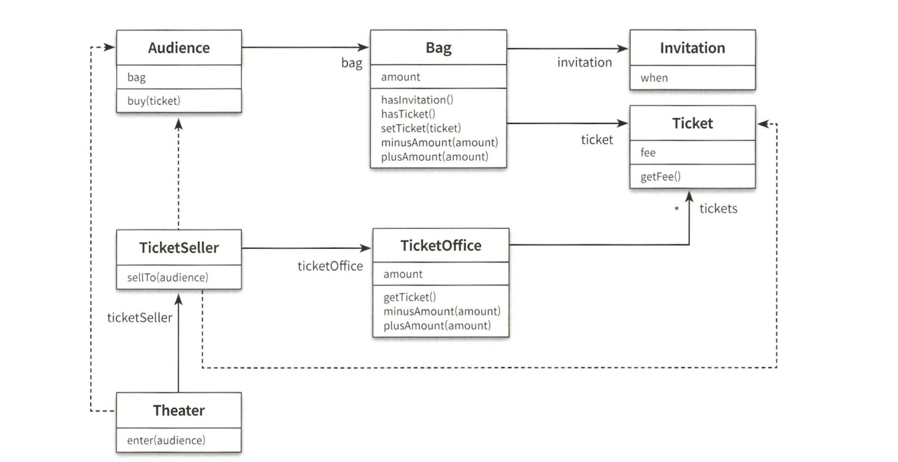
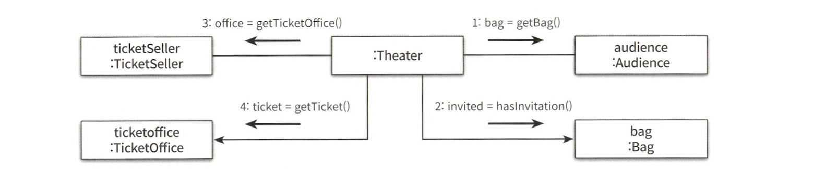
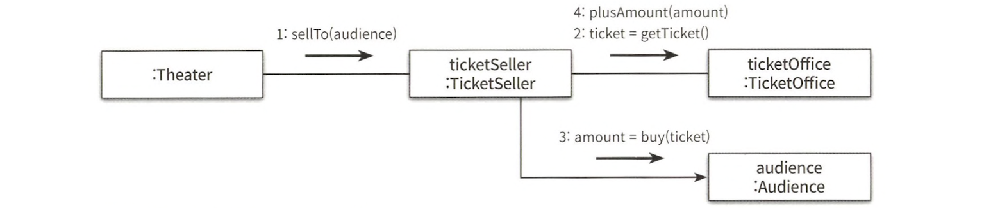
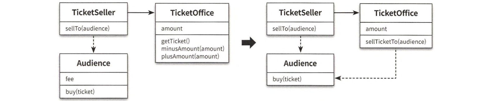

# 1. 객체, 설계

작은 소극장을 경영하고 있다고 상상해 봅시다.  
홍보도 겸할 겸 관람객들의 발길이 이어지도록 작은 이벤트를 기획하기로 했습니다.  
이벤트의 내용은 추첨을 통해 선정된 관람객에게 공연을 무료로 관람할 수 있는 초대장을 배부하는 것입니다.  
이벤트 당일이 되었고 티켓 판매 애플리케이션은 요구사항을 모두 만족시켜야 합니다.

## 1.1. 티켓 판매 애플리케이션 구현하기

### 1.1.1. 요구사항

- 이벤트에 당첨되지 않은 관람객은 티켓을 구매해야만 입장할 수 있다.
- 이벤트에 당첨된 관람객은 초대장을 티켓으로 교환한후에 입장할 수 있다.
- 티켓 판매자는 관람객을 입장시키기 전에 이벤트 당첨 여부를 확인해야 하고  
  이벤트 당첨자가 아닌 경우에는 티켓을 판매한 후에 입장시켜야 한다.

### 1.1.2. 클래스 구현


1. 소극장은 먼저 관람객의 가 안에 초대장이 들어 있는지 확인한다.
2. 만약 초대장이 들어 있다면 이벤트에 당첨된 관람객이므로  
   판매원에게서 받은 티켓을 관람객의 가방 안에 넣어준다.
3. 가방안에 초대장이 없다면 티켓을 판매해야 한다.
4. 이 경우소극장은 관람객의 가방에서 티켓 금액만큼을 차감한 후 매표소에 금액을 증가시킨다.
5. 마지막으로 소극장은 관람객의 가방 안에 티켓을 넣어줌으로써 관람객의 입장 절차를 끝낸다.

```kotlin
class Theater(private val ticketSeller: TicketSeller) {
    fun enter(audience: Audience) {
        if (audience.bag().hasInvitation()) {
            val ticket: Ticket = ticketSeller.ticketOffice().ticket()
            audience.bag().getTicket(ticket)
        } else {
            val ticket: Ticket = ticketSeller.ticketOffice().ticket()
            audience.bag().minusAmount(ticket.fee)
            ticketSeller.ticketOffice().plusAmount(ticket.fee)
            audience.bag().setTicket(ticket)
        }
    }
}
```

작성된 프로그램의 로직은 간단하고 예상대로 동작하지만  
하지만 안타깝게도 이 작은 프로그램은 몇 가지 문제점을 가지고 있습니다.

## 1.2. 무엇이 문제인가?

로버트 마틴(Robert C. Martin)은 소프트웨어 모듈이 가져야 하는 세 가지 기능에 관해 설명합니다.  
(모듈이란 클래스나 패키지, 라이브러리와 같이 프로그램을 구성하는 임의의 요소를 의미합니다.)

1. 첫 번째 목적은 실행 중에 제대로 동작하는 것이다
2. 두 번째 목적은 변경을 위해 존재하는 것이다
3. 세 번째 목적은 코드를 읽는 사람과 의사소통하는 것이다

모든 모듈은 제대로 실행돼야 하고 변경이 용이해야 하며 이해하기 쉬워야 합니다.  
작성한 프로그램은 관람객들을 입장시키는 데 필요한 기능을 오류 없이 정확하게 수행하고 있습니다.

따라서 제대로 동작해야 한다는 제약은 만족시키지만  
**불행하게도 변경 용이성과 읽는 사람과의 의사소통이라는 목적은 만족시키지 못합니다.**

### 1.2.1. 예상을 빗나가는 코드

#### 1.2.1.1. 수동적인 존재

**문제는 관람객과 판매원이 소극장의 통제를 받는 수동적인 존재하는 점입니다.**

1. **소극장은 관람객의 가방을 열어** 그 안에 초대장이 들어 있는지 살펴본다.
2. 가방 안에 초대장이 들어 있으면 **판매원은 매표소에 보관돼 있는 티켓을 관람객의 가방 안으로 옮긴다.**
3. 가방 안에 초대장이 들어 있지 않다면 **관람객의 가방에서 티켓 금액만큼의 현금을 꺼내**  
   매표소에 적립한 후에 매표소에 보관돼 있는 **티켓을 관람객의 가방 안으로 옮긴다.**

허락도 없이 매표소에 보관 중인 티켓과 현금에 마음대로 접근하고 있습니다.  
티켓을 꺼내 관람객의 가방에 집어넣고 관람객에게서 받은 돈을 매표소에 적립하는 일도 수행합니다.  
**현재의 코드는 우리의 상식과는 다르게 동작하기 때문에 코드를 읽는 사람과 제대로 의사 소통하지 못합니다.**

#### 1.2.1.2. 여러 가지 세부적인 내용들을 기억해야한다.

Theater의 enter 메서드를 이해하기 위해서는 Audience가 Bag을 가지고 있고  
Bag 안에는 현금과 티켓이 들어 있으며 TicketSeller가 TicketOffice에서 티켓을 판매하고  
TicketOffice 안에 돈과 티켓이 보관돼 있다는 모든 사실을 동시에 기억하고 있어야 합니다.

하나의 클래스나 메서드에서 너무 많은 세부사항을 다루기 때문에  
**코드를 작성하는 사람뿐만 아니라 코드를 읽고 이해해야 하는 사람 모두에게 큰 부담을 주고 있습니다.**

- **하지만 가장 심각한 문제는 Audience와 TicketSeller 를 변경할 경우 Theater도 함께 변경해야하는 것입니다.**

### 1.2.2. 변경에 취약한 코드

아래와 같은 새로운 요구사항이 들어온다고 가정해봅시다.

- 관람객이 가방을 들고 있지 않다면 어떻게 해야 할까?
- 관람객이 현금이 아니라 신용카드를 이용해서 결제 한다면 어떻게 해야 할까?
- 판매원이 매표소 밖에서 티켓을 판매해야 한다면 어떻게 해야 할까?

아마, 해당 변경사항을 적용하게 된다면 모든 코드가 일시에 흔들리게(변경) 될 것입니다.  
이 같은 문제점은 객체 사이의 의존성과 관련된 문제점입니다.

- **의존성은 어떤 객체가 변경될 때 그 객체에게 의존하는 다른 객체도 함께 변경될 수 있다는 사실이 내포돼 있다.**

객체 사이의 의존성을 제거하라는 의미는 아닙니다.  
`객체지향 설계는 서로 의존하면서 협력하는 객체들의 공동체를 구축하는 것`입니다.  
따라서 애플리케이션의 기능을 구현하는 데 **필요한 최소한의 의존성만 유지하고 불필요한 의존성을 제거하는 것입니다.**

객체 사이의 의존성이 과한 경우를 가리켜 결합도(couping)가 높다고 말합니다.  
두 객체 사이의 결합도가 높으면 높을수록 함께 변경될 확률도 높아지기 때문에  
**객체 사이의 결합도를 낮춰 변경이 용이한 설계를 만들어야 합니다.**


클래스 다이어그램을 살펴보면, Theater 클래스가 너무 많은 의존성을 가지고 있는 것을 확인할 수 있습니다.  
즉, 객체 사이의 결합도가 너무 높았던 문제가 있음을 우리는 깨달았습니다.

## 1.3. 설계 개선하기

### 1.3.1. Theater 개선하기

설계를 변경하기 어려운 이유는 Theater가 Audience와 TicketSellr 뿐만 아니라  
Audience 소유의 Bag 과 TicketSeller가 근무하는 TicketOffcie 까지 마음대로 접근할 수 있기 때문입니다.

해결 방법은 Audience와 TicketSeller가  
직접 Bag 과 Ticketoffice 를 처리하는 자율적인 존재가 되도록 설계를 변경하는 것입니다.

```kotlin
class TheaterSeller(
    private val ticketOffice: TicketOffice
) {

    fun sellTo(audience: Audience) {
        if (audience.getBag().hasInvitation()) {
            val ticket = ticketOffice.getTicket()
            audience.getBag().getTicket(ticket)
            return
        }
        val ticket = ticketOffice.getTicket()
        audience.getBag().minusAmount(ticket.fee)
        ticketOffice.plusAmount(ticket.fee)
        audience.getBag().setTicket(ticket)
    }
}
```

```kotlin
class Theater(
    private val ticketSeller: TicketSeller
) {
    fun enter(audience: Audience): Theater =
        Theater(ticketSeller.sellTo(audience))
}
```

이처럼 개념적이나 물리적으로 객체 내부의 세부적인 사항을 감추는 것을 캡슐화라고 부릅니다.  
캡슐화를 통해 객체 내부로의 접근을 제한하면  
객체와 객체 사이의 결합도를 낮출 수 있기 때문에 설계를 좀 더 쉽게 변경할 수 있게 됩니다.


Theater는 오직 TicketSeller 의 인터페이스(interface)에만 의존합니다.  
TicketSellr 가 내부에 Ticketoffice 인스턴스를 포함하고 있다는 사실은 구현(implementation)의 영역에 속합니다.  
**객체를 인터페이스와 구현으로 나누고 인터페이스만을 공개하는 것은**  
객체 사이의 결합도를 낮추고 변경하기 쉬운 코드를 작성하기 위해 따라야 하는 **가장 기본적인 설계 원칙입니다.**

### 1.3.2. Audience 및 TicketSeller 개선하기

```kotlin
class Audience(
    private val bag: Bag
) {
    fun buy(ticket: Ticket): Long =
        bag.hold(ticket)
}
```

```kotlin
class TheaterSeller(
    private val ticketOffice: TicketOffice
) {

    fun sellTo(audience: Audience) {
        ticketOffice.plusAmount(audience.buy(ticketOffice.getTicket()))
    }
}
```

수정된 Audience 는 자신이 가지고 있는 소지품을 스스로 관리합니다.  
따라서 코드를 읽는 사람과의 의사소통이라는 관점에서 이 코드는 확실히 개선된 것으로 보입니다.



더 중요한 점은 Audience나 TicketSeller의 내부 구현을 변경하더라도 Theater를 함께 변경할 필요가 없어졌다는 것입니다.  
따라서 수정된 코드는 변경 용이성의 측면에서도 확실히 개선됐다고 말할 수 있습니다.

### 1.3.3. 무엇을 어떻게 개선했는가?

수정된 Audience와 TicketSellr 는 자신이 가지고 있는 소지품을 스스로 관리하고 있습니다.  
따라서 코드를 읽는 사람과의 의사소통이라는 관점에서 이 코드는 확실히 개선된 것으로 보입니다.

방법은 이렇습니다.

- 판매자가 티켓을 판매하기 위해 TicketOffice 사용하는 모든 부분을 TicketSeller 내부로 옮깁니다.
- 관람객이 티켓을 구매하기 위해 Bag을 사용하는 모든 부분을 Audience 내부로 옮깁니다.

**즉, 자기 자신의 문제를 스스로 해결하도록 코드를 변경한 것입니다.**  
우리는 우리의 직관을 따랐고 그 결과로 코드는 변경이 용이하고 이해 가능하도록 수정되었습니다.

반대로 문제를 스스로 해결하지 않는 코드는 다른 불필요한 객체에 의존하는 형태로 설계될 수 있으며  
이는 곧 결합도의 증가 + 시소한 변경에도 의존 대상에 영향을 주는 형태로 발전될 수 있습니다.

### 1.3.4. 캡슐화와 응집도

**결국 핵심은 객체 내부의 상태를 캡슐화하고 객체 간에 오직 메시지를 통해서만 상호작용하도록 만드는 것입니다.**  
Theater는 TicketSeller의 내부에 대해서는 전혀 알지 못합니다.  
단지 TicketSeller가 sellTo 메시지를 이해하고 응답할 수 있다는 사실만 알고 있을 뿐입니다.

밀접하게 연관된 작업만을 수행하고  
연관성 없는 작업은 다른 객체에게 위임하는 객체를 가리켜 응집도(cohesion)가 높다고 말합니다.  
**자신의 데이터를 스스로 처리하는 자율적인 객체를 만들면 결합도를 낮출 수 있을뿐더러 응집도를 높일 수 있습니다.**

객체의 응집도를 높이기 위해서는 객체 스스로 자신의 데이터를 책임져야 합니다.  
자신이 소유하고 있지 않은 데이터를 이용해 작업을 처리하는 객체에게 어떻게 연관성 높은 작업들을 할당할 수 있겠습니까?  
그렇기에 객체는 자신의 데이터를 스스로 처리하는 자율적인 존재여야 합니다.

외부의 간섭을 최대한 배제하고  
메시지를 통해서만 협력하는 자율적인 객체들의 공동체를 만드는 것이 훌륭한 객체지향 설계를 얻을 수 있는 지름길입니다.

### 1.3.5. 절차지향과 객체지향

수정하기 전의 코드 관점에서  
Theater의 enter 메서드는 `프로세스(Process)`이며 Audience, TicketSeller, Bag, TicketOffice는 `데이터(Data)` 입니다.  
**프로세스와 데이터를 별도의 모듈에 위치시키는 방식을 절차적 프로그래밍 (Procedural Programming) 이라고 부릅니다.**  
**모든 처리가 하나의 클래스 안에 위치하고 나머지 클래스는 단지 데이터의 역할만 수행하기 때문입니다.**

절차적 프로그래밍은 우리의 예상을 너무나도 쉽게 벗어나기 때문에 코드를 읽는 사람과 원활하게 의사소통하지 못합니다.  
더 큰 문제는 데이터의 변경으로 인한 영향을 지역적으로 고립시키기 어렵습니다.  
변경은 버그를 부르고 버그에 대한 두려움은 코드를 변경하기 어렵게 만듭니다.  
따라서 절차적 프로그래밍의 세상은 변경하기 어려운 코드를 양산하는 경향이 있습니다.

- **변경하기 쉬운 설계는 한 번에 하나의 클래스만 변경할 수 있는 설계다.**

해결 빙법은 자신의 데이터를 스스로 처리하도록 프로세스의 적절한 단계를 내부로 이동시키는 것입니다.  
수정한 후의 코드에서는 데이터를 사용하는 프로세스가 데이터를 소유하고 있는 Audience와 Ticketsellr 내부로 옮겨졌습니다.

이처럼 데이터와 프로세스가 동일한 모듈 내부에 위치하도록 프로그래밍하는 방식을  
**객체지향 프로그래밍(Object-Oriented Programming)이라고 부릅니다**

훌륭한 객체지향 설계의 핵심은 **캡슐화를 이용해 의존성을 적절히 관리함으로써 객체 사이의 결합도를 낮추는 것입니다.**

### 1.3.6. 책임의 이동

변경 전/후의 방식 사이에 근본적인 차이를 만드는 것은 **책임의 이동**입니다.



위 그림에서 알 수 있듯이 작업 흐름이 주로 Theater에 의해 제어된다는 사실을 알 수 있습니다.  
객체지향 세계의 용어를 사용해서 표현하면 책임이 Theater에 집중돼 있는 것입니다.



변경 후의 객체지향 설계에서는 각 객체가 자신이 맡은 일을 스스로 처리했습니다.  
다시 말해 Theater에 몰려 있던 책임이 개별 객체로 이동한 것입니다.(책임의 이동)

객체지향 설계에서는 독재자가 존재하지 않고 각 객체에 책임이 적절하게 분배됩니다.  
따라서 각 객체는 자신을 스스로 책임집니다.  
**객체지향 애플리케이션은 스스로 책임을 수행하는 자율적인 객체들의 공동체를 구성함으로써 완성됩니다.**

객체지향 설계의 핵심은 적절한 객체에 적절한 책임을 할당하는 것입니다.  
객체는 다른 객체와의 협력이라는 문맥 안에서 특정한 역할을 수행하는 데 필요한 적절한 책임을 수행해야 합니다.  
**따라서 객체가 어떤 데이터를 가지느냐보다는 객체에 어떤 책임을 할당할 것이냐에 초점을 맞춰야 합니다.**

설계를 어렵게 만드는 것은 의존성이라는 것을 기억해야합니다.  
해결 방법은 불필요한 의존성을 제거함으로써 객체 사이의 결합도를 낮추는 것입니다.  
불필요한 세부사항을 객체 내부로 캡슐화하는 것은  
객체의 자율성을 높이고 응집도 높은 객체들의 공동체를 창조할 수 있게 합니다.  
불필요한 세부사항을 캡슐화하는 자율적인 객체들이 낮은 결합도와 높은 응집도를 가지고 협력하도록  
**최소한의 의존성만을 남기는 것이 훌륭한 객체지향 설계입니다.**

### 1.3.7. 조금 더 개산해보자

Audience는 스스로 티켓을 구매하고 가방안의 내용물을 직접 관리합니다.  
하지만 Bag은 과거의 Audience처럼 스스로 자기 자신을 책임지지 않고 Audience에 의해 끌려다니는 수동적인 존재입니다.
Bag을 자율적인 존재로 바꿔보면 아래와 같습니다.

```kotlin
class Bag(
    private val amount: Long = 0L,
    private val invitation: Invitation? = null,
    private var ticket: Ticket? = null
) {

    fun hold(ticket: Ticket): Long {
        if (hasInvitation()) {
            setTicket(ticket)
            return 0L
        }
        minusAmount(ticket.fee)
        setTicket(ticket)
        return ticket.fee
    }

    private fun hasInvitation(): Boolean = invitation != null

    private fun minusAmount(amount: Long): Bag =
        Bag(this.amount - amount, invitation, ticket)

    private fun setTicket(ticket: Ticket) {
        this.ticket = ticket
    }
}
```

TicketSeller 역시 TicketOffice의 자율권을 침해하였기에 자울적으로 바꾸었습니다.

```kotlin
class TicketSeller(
    private val ticketOffice: TicketOffice
) {
    fun sellTo(audience: Audience): TicketSeller =
        TicketSeller(ticketOffice.sellTicketTo(audience))
}
```

```kotlin
class TicketOffice(
    private val amount: Long,
    private val tickets: MutableList<Ticket> = mutableListOf()
) {
    fun sellTicketTo(audience: Audience): TicketOffice =
        plusAmount(audience.buy(getTicket()))

    fun plusAmount(amount: Long): TicketOffice =
        TicketOffice(this.amount + amount, tickets)

    fun getTicket(): Ticket =
        tickets.removeAt(0)
}
```

안타깝게도 이 변경은 처음에 생각했던 것만큼 만족스럽지 않습니다.  
그 이유는 TicketOffice와 Audience 사이에 의존성이 추가됐기 때문입니다.



변경 전에는 존재하지 않았던 새로운 의존성이 추가된 것입니다.  
의존성의 추가는 높은 결합도를 의미하고, 높은 결합도는 변경하기 어려운 설계를 의미합니다.  
TicketOffice의 자율성은 높였지만 전체 설계의 관점에서는 결합도가 상승했습니다.

Audience에 대한 결합도와 Ticketoffice의 자율성 모두를 만족시키는 방법이 잘 떠오르지 않습니다.  
**트레이드오프의 시점이 왔습니다.**  
우리는 Ticketoffice의 자율성보다는 Audience에 대한 결합도를 낮추는 것이 더 중요하다는 결론에 도달했습니다.

이 예시를 통해 2가지 사실을 알 수 있습니다.

1. 어떤 기능을 설계하는 방법은 한 가지 이상일 수 있습니다.
2. 동일한 기능을 한 가지 이상의 방법으로 설계할 수 있기 때문에 결국 설계는 트레이드오프의 산물입니다.

설계는 균형의 예술입니다.  
어떤 경우에도 모든 사람들을 만족시킬 수 있는 설계를 만들 수는 없습니다.  
훌륭한 설계는 적절한 트레이드오프의 결과물임을 명심해야합니다.  
이러한 트레이드오프 과정이 설계를 어려우면서도 흥미진진한 작업으로 만들어주는 것입니다.

### 1.3.8. 그래 거짓말이다.

- **현재의 코드는 우리의 상식과는 다르게 동작하기 때문에 코드를 읽는 사람과 제대로 의사 소통하지 못합니다.**

앞서 얘기했듯이 우리의 상식을 벗어난 동작이 발생하면 코드에 대한 이해력이 낮아집니다.  
하지만 TicketOffice, Theater, Bag 이 같은 요소들은 사실 실세계에서는 자율적인 존재가 아닙니다.(무생물)

**사실, 객체지향 세계에서는 무생물 역시 스스로 행동하고 자기 자신을 책임지는 자율적인 존재로 취급한 것입니다.**  
현실에서는 수동적인 존재라고 하더라도 일단 객체지향의 세계에 들어오면 모든 것이 능동적이고 자율적인 존재로 바뀝니다.  
이처럼 능동적이고 자율적인 존재로 소프트웨어 객체를 설계하는 원칙을 가리켜 의인화라고 부릅니다.

이제 말을 조금 바꾸겠습니다.  
**훌륭한 객체지향 설계란 소프트웨어를 구성하는 모든 객체들이 자율적으로 행동하는 설계를 가리킵니다.**  
그 대상이 비록 실세계에서는 생명이 없는 수동적인 존재라고 하더라도  
객체지향의 세계로 넘어오는 순간 그들은 **생명과 지능을 가진 싱싱한 존재로 다시 태어나는 것입니다.**

## 1.4. 객체지향 설계

## 1.4.1. 설계가 왜 필요한가?

- 설계란 코드를 배치하는 것이다.

설계는 코드를 작성하는 매 순간 코드를 어떻게 배치할 것인지를 결정하는 과정에서 나옵니다.  
설계는 코드 작성의 일부이며 코드를 작성하지 않고서는 검증할 수 없습니다.  
그렇기 때문에 설계를 구현과 떨어트려서 이야기하는 것은 불가능합니다.

**좋은 설계란 오늘 요구하는 기능을 온전히 수행하면서 내일의 변경을 매끄럽게 수용할 수 있는 설계입니다.**

- 요구사항이 항상 변경되기 때문입니다.
- 코드를 변경할 때 버그가 추가될 가능성이 높기 때문입니다.

## 1.4.2. 객체지향 설계

객체지향 프로그래밍은 의존성을 효율적으로 통제할 수 있는 다양한 방법을 제공함으로써  
요구사항 변경에 좀 더 수월하게 대응할 수 있는 가능성을 높여줍니다.

- 변경 가능한 코드란 이해하기 쉬운 코드다.

객체지향 패러다임은 세상을 바라보는 방식대로 코드를 작성할 수 있게 돕습니다.  
세상에 존재하는 모든 자율적인 존재처럼 객체 역시 자신의 데이터를 스스로 책임지는 자율적인 존재입니다.  
객체지향은 세상에 대해 예상하는 방식대로 객체가 행동하리라는 것을 보장함으로써 코드를 좀 더 쉽게 이해할 수 있게 합니다.

훌륭한 객체지향 설계란 협력하는 객체 사이의 의존성을 적절하게 관리하는 설계입니다.  
기능을 구현하기 위해 객체들이 협력하는 과정 속에서 객체들은 다른 객체에 의존하게 됩니다.  
메시지를 전송하기 위한 이런 지식이 두 객체를 결합시키고 이 결합이 객체 사이의 의존성을 만듭니다.  
**진정한 객체지향 설계로 나아가는 길은**  
**협력하는 객체들 사이의 의존성을 적절하게 조잘함으로써 변경에 용이하도록 만드는 것입니다.**
